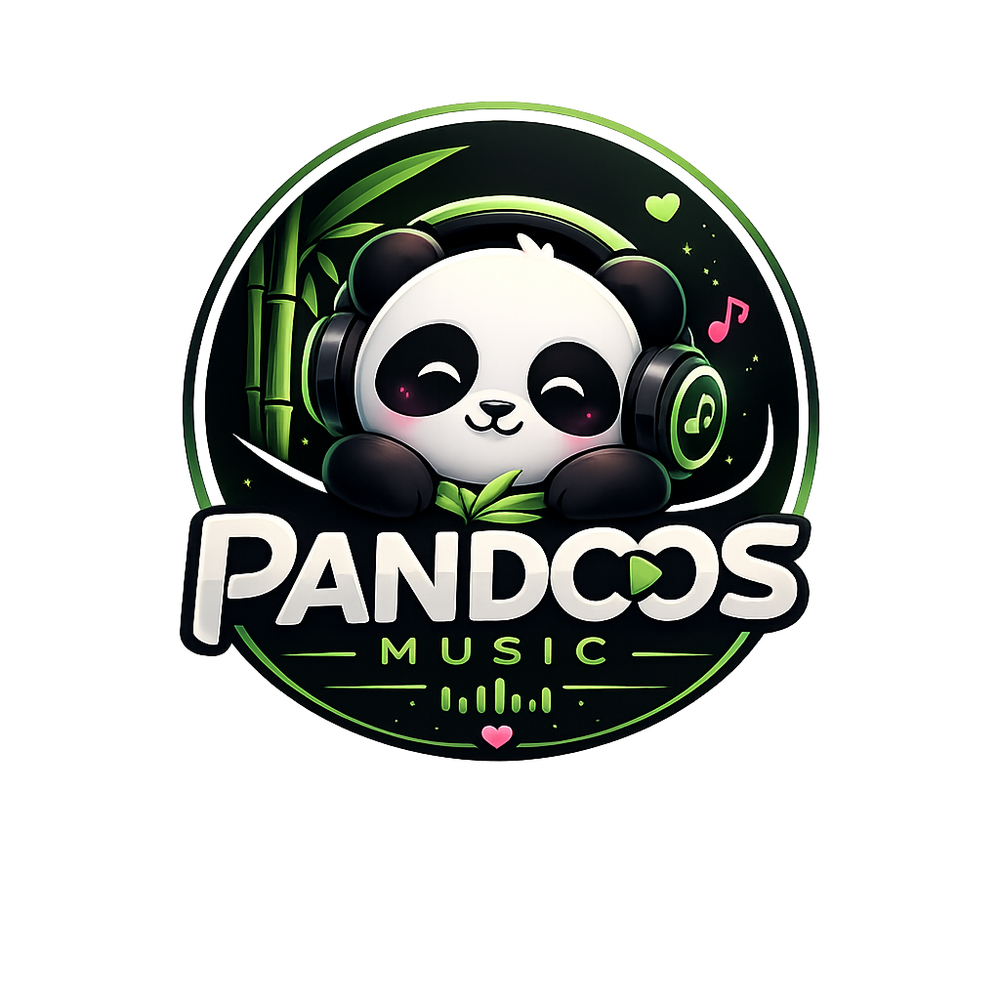

  
  
  # 🐼 Pandoos Music
  
  **Where Pandas Vibe.**
  
  A completely reimagined listening experience designed for maximum chill, intense focus, and pure sonic energy. Beautifully crafted, lightning fast, and built to adapt to whatever mood you're in.

  

    <a href="https://pandoos.vercel.app"><b>Open Web App</b></a> • 
    <a href="https://github.com/Rajvansh-1/pandoos/releases"><b>Download Desktop App</b></a>
  

---

## 🎶 The Experience

Pandoos isn't just a music player. It's a living environment. 

- **Vibe-Driven Curation**: Our dynamic mood engine curates exactly what you need—whether you're crushing a workout, locking in for deep work, or just kicking back.
- **Panda Gamification**: Level up your listening. Earn mysterious badges, unlock ranks from *Bamboo Novice* to *Zen Oracle*, and track your daily streaks.
- **Silky Smooth Aesthetics**: A handcrafted interface featuring adaptive dynamic coloring, glassmorphism, fluid micro-animations, and full-screen immersive modes.
- **Native Desktop Integration**: Download the desktop app for native media key support, background playback, and beautiful OS-level notifications.

## 🚀 Features

- 🎧 **Unlimited Listening**: Find almost any track in the world and play it instantly.
- 🎨 **Adaptive Color Extraction**: The entire app fluidly shifts its color palette to match the artwork of your currently playing track.
- 🏆 **Gamified Journey**: Track your listening hours, build your streak, and earn rare achievements.
- 🌙 **Deep Immersive Mode**: Click the album art to enter a distraction-free, cinematic full-screen player.
- ⚡ **Desktop & Web**: Play flawlessly in your browser, or install the lightweight desktop app for Windows, macOS, and Linux.

---

## 📥 Download

The desktop app brings the ultimate Pandoos experience directly to your OS, bypassing the browser entirely.

**[Download the latest release for Windows, macOS, or Linux here](https://github.com/Rajvansh-1/pandoos/releases)**

*(If you receive a SmartScreen or Gatekeeper warning on first launch, click "More info" and "Run anyway" — Pandoos is completely safe.)*

---

## 🐾 Join the Vibe

Music is better when you're not alone. Share your badges, compare your top moods, and discover what the Pandas are listening to.

*"Life is short relax like a Panda and enjoy music"*

  Built with ❤️ for the love of music.

